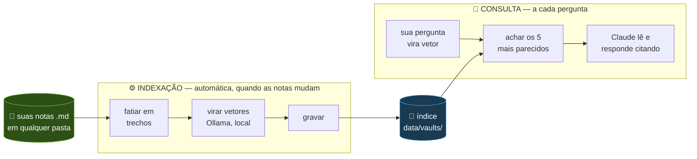

# Mapa do dev-second-brain

Documento de acompanhamento do projeto. Responde quatro perguntas:

- **[Onde estamos e o que fazer agora](#1-onde-estamos)**
- **[Como o sistema funciona](#2-como-o-sistema-funciona)**
- **[O que já está pronto](#3-o-que-já-está-pronto)** · **[O que falta e as ideias](#4-o-que-falta--o-backlog)**
- **[Por que as coisas são assim](#5-decisões-tomadas-e-por-quê)**

Tem também **[como medimos a qualidade](#6-qualidade-como-medimos)**, os
**[experimentos que não deram certo](#7-experimentos-que-não-deram-certo)** e um
**[glossário](#8-glossário)** com todo termo técnico usado aqui.

_Última atualização: 2026-08-14_

---

## 1. Onde estamos

> **O ciclo fechou: consultar e registrar funcionam sem esforço.**
> A ferramenta é usável todo dia, de dentro de qualquer projeto, e as decisões viram
> nota sozinhas ao fim do trabalho. **A próxima escolha é sua** — ver abaixo.


### Estado por frente

| Frente | O que significa | Estado |
|---|---|---|
| 🔓 **Alcance** | a ferramenta existe onde você trabalha | ✅ resolvido |
| 🔄 **Frescor** | o índice nunca responde com texto velho | ✅ resolvido |
| 🎯 **Busca** | encontrar o trecho certo | ✅ perto do teto (97%) |
| 🧭 **Confiança** | saber quando algo foi decidido e se ainda vale | ✅ resolvido |
| ✍️ **Captura** | as notas existirem sem esforço | ✅ resolvido em 2026-08-14 |
| 🖥️ **Interface** | tela própria | ⬜ adiada, virou opcional |

### 🎯 A próxima escolha

Nenhuma frente está travando a ferramenta. As duas candidatas, com o trade-off:

| Candidata | O que destrava | Custo |
|---|---|---|
| **Ingestão de fontes extensas** | apontar para uma documentação grande e quebrá-la em notas temáticas, em vez de indexar arquivos gigantes inteiros | é a que mais mexe no `indexer.ts`; precisa decidir como cortar sem perder contexto |
| **Vault automático pelo diretório** | deduzir o projeto pela pasta onde você está, sem dizer o nome | menor e mais barata; hoje quem resolve isso é o bloco no `CLAUDE.md`, que já nomeia o vault |

**Recomendação:** a segunda tem menos valor agora justamente porque o bloco de captura
já cobre o caso comum. A primeira ataca um limite real — vaults grandes como o `grupo03`
foram indexados como estão, sem tratamento. Mas nenhuma das duas é urgente:
**usar a ferramenta por alguns dias antes de escolher é uma opção legítima.**

### O que deliberadamente NÃO fazer agora

| Não fazer | Por quê |
|---|---|
| Interface própria (Fase 2) | O Claude Code já é a interface. Construir tela agora adia o que de fato limita a ferramenta |
| Trocar JSON por banco | O JSON aguenta muito além do volume atual. Gatilhos na [seção 5](#quando-trocar-de-armazenamento) |
| Mais ajuste na busca | Recall@5 está em 97% e duas tentativas seguidas foram reprovadas ([seção 7](#7-experimentos-que-não-deram-certo)) |
| Reagir a queda no Recall@1 | O acervo crescendo derruba o Recall@1 sozinho, sem nada ter piorado. Ver [seção 6](#o-acervo-compete-consigo-mesmo) antes de "consertar" |
| Gerar nota de commit do git | Commit não é decisão. Geraria ruído que afoga as notas boas |
| Religar busca lexical ou grafo | Foram desligadas com dado. Religar é medir de novo, não editar padrão por intuição |

---

## 2. Como o sistema funciona

### A ideia central

> **Os arquivos `.md` são a fonte da verdade. Todo o resto é derivado deles.**

Apagar o índice não perde nada — reconstrói com um comando. Apagar as notas perde tudo.
Isso mantém seus dados portáteis, legíveis sem programa nenhum e independentes de
qualquer banco, modelo ou fornecedor.

### O caminho da informação



### O conceito que faz tudo funcionar: dois tempos separados

Transformar texto em vetor é **lento** (~1 segundo por trecho). Comparar vetores é
**instantâneo** (4 milissegundos para 1.543 trechos).

Se o trabalho pesado acontecesse a cada pergunta, a ferramenta seria inutilizável. Como
ele acontece **antes**, uma vez só, e o resultado é guardado, cada pergunta é barata.

É por isso que existe indexação separada da consulta. Não é detalhe de implementação —
é o que torna a coisa viável.

### As peças de código

| Arquivo | O que faz |
|---|---|
| `src/vaults.ts` | Lê o `vaults.json` e encontra os `.md` de cada projeto |
| `src/frontmatter.ts` | Lê os metadados do topo das notas (data, status) |
| `src/indexer.ts` | Fatia, transforma em vetores e grava. Usado pelo CLI e pelo servidor |
| `src/embed.ts` | Fala com o Ollama para transformar texto em vetor |
| `src/concurrency.ts` | Faz várias chamadas ao Ollama em paralelo, com limite |
| `src/store.ts` | **Onde os dados moram.** Gravar, carregar, comparar, buscar |
| `src/notes.ts` | Cria notas novas a partir da conversa, com nome de arquivo seguro |
| `src/mcp-server.ts` | Expõe as ferramentas ao Claude Code |
| `src/ingest.ts` · `src/ask.ts` · `src/eval.ts` | Comandos de terminal |
| `src/lexical.ts` · `src/links.ts` | Experimentos desligados ([seção 7](#7-experimentos-que-não-deram-certo)) |

> Tudo que sabe **onde os dados estão guardados** vive em `store.ts`. Trocar JSON por
> um banco um dia significa reescrever esse arquivo e mais nada.

---

## 3. O que já está pronto

### Você consegue, hoje

| Capacidade | Como se usa |
|---|---|
| Perguntar sobre decisões passadas | conversando, de qualquer pasta do computador |
| Registrar uma decisão | *"anota que decidimos X porque Y"* |
| Adicionar um projeto novo | *"adiciona esse projeto ao meu segundo cérebro"* |
| Buscar em um projeto ou em todos | dizendo o projeto, ou não dizendo |
| Perguntar sobre um período | *"o que decidimos em julho?"* |
| Editar notas no editor | a busca acompanha sozinha, sem comando |
| **Fechar o dia sem perder nada** | dizendo *"é isso por hoje"* — o Claude revisa a conversa, checa o que já está registrado e oferece gravar o resto |
| **Ligar a captura num projeto** | *"instala a regra de registro aqui"* — o bloco vai para o `CLAUDE.md` dele |

### Por baixo

| Recurso | O que resolve |
|---|---|
| **Vaults por projeto** | Sem isso, "por que Postgres?" traria um projeto que adotou e outro que descartou, na mesma resposta |
| **Indexação incremental** | Editar uma nota custa 0,5s em vez de reprocessar tudo |
| **Frescor automático** | O índice se atualiza antes de responder; nunca devolve texto velho |
| **Front-matter** | Data e status nas notas: habilita filtro por período e alerta de decisão revista |
| **Escrita restrita** | Notas suas nunca são gravadas dentro do repositório de um cliente |
| **Ritual de captura** | Uma instrução no `CLAUDE.md` do projeto, instalada pelo `add_vault`, faz o registro acontecer sem você pedir |
| **Revisão antes de gravar** | `review_decisions` mostra as notas parecidas que já existem, para não encher o acervo de repetição |
| **Prova de qualidade** | 39 perguntas com gabarito; toda mudança na busca é medida |

**Vaults ativos:** `taskflow` (15 trechos, exemplo) · `dev-second-brain` (69) ·
`grupo03` (1.544, projeto real)

**Captura ligada em:** `dev-second-brain` · `grupo03`

---

## 4. O que falta — o backlog

Ordenado por **quanto destrava**, não por quanto é interessante.

### ✍️ Captura

| | Ideia | O que é |
|---|---|---|
| ✅ | **Captura de fim de sessão** | Feito em 2026-08-14. Regra no `CLAUDE.md` + `review_decisions` |
| 🎯 | **Ingestão de fontes extensas** | Apontar para documentação grande e quebrar em várias notas temáticas. **Candidata ao próximo passo** |

### 🧭 Confiança e organização

| | Ideia | O que é |
|---|---|---|
| 🎯 | **Vault automático pelo diretório** | Deduzir o projeto pela pasta onde você está, sem precisar dizer. **Candidata ao próximo passo** |
| ⬜ | **Contexto hierárquico no trecho** | Cada trecho carregar o caminho completo de títulos (`Decisão banco > Alternativas > MongoDB`) |

### 🖥️ Interface

| | Ideia | O que é |
|---|---|---|
| ⬜ | **Aplicativo local** | Tela própria com campo de busca. **Rebaixado a opcional**: o Claude Code já cumpre esse papel |

### 🗄️ Descartados por medição ou por análise

| Ideia | Por que saiu |
|---|---|
| Busca lexical (BM25) | Construída e medida: piorava o Recall@5 ([seção 7](#7-experimentos-que-não-deram-certo)) |
| Expansão por grafo | Construída e medida: nenhum ganho no tamanho de acervo atual |
| Peso por recência | A ordenação natural já coloca a decisão vigente acima da revista, sem ajuda |
| Reranking | Complexidade alta para ganho marginal neste volume |
| Notas a partir de commits do git | Commit não é decisão; geraria ruído demais |
| Postgres + pgvector | Só faria sentido com interface web; o app local não precisa |

---

## 5. Decisões tomadas e por quê

Registradas para não serem rediscutidas do zero. Cada uma tem a alternativa descartada.

| Tema | Decisão | Por quê | Descartado |
|---|---|---|---|
| **Fonte da verdade** | arquivos `.md` | portáteis, legíveis, versionáveis; o índice é descartável | guardar o conteúdo dentro de um banco |
| **Modelo de embedding** | `bge-m3` (local, Ollama) | multilíngue; o anterior era treinado em inglês e falhava com português | `nomic-embed-text`, API da OpenAI |
| **Onde guardar o índice** | arquivo JSON por vault | zero dependências, dados inspecionáveis, matemática visível | SQLite vetorial, Postgres |
| **Como buscar** | similaridade de cosseno, varredura linear | 4ms para 1.543 trechos — simplicidade sem custo | índice aproximado |
| **Quem redige a resposta** | o próprio Claude Code, via MCP | sem chave de API, sem custo extra, disponível em qualquer pasta | API paga, modelo local de geração |
| **Organização** | um vault por projeto | isolamento é questão de **corretude**, não de arrumação | tudo num índice só |
| **Interface** | conversa no terminal | já existe e funciona; app fica opcional | app web, Electron, Tauri |
| **Captura** | regra escrita no `CLAUDE.md`, instalada pelo `add_vault` | zero código, testável na hora; o gatilho fica em sinais que o Claude consegue observar | hook do Claude Code (adiado, não descartado) |
| **Formato da nota** | uma nota por decisão | um trecho que mistura assuntos não casa forte com pergunta nenhuma | nota-diário de sessão |
| **Duplicatas** | mostrar as notas vizinhas e deixar o Claude julgar | medido: decisão ausente do acervo ainda pontua ~0,52 — não existe limiar que separe | limiar automático de duplicata |

### Quando trocar de armazenamento

O JSON não é para sempre. Os sinais de que chegou a hora:

| Sintoma | O que fazer |
|---|---|
| Carregar o índice passa de ~2s por pergunta | SQLite com extensão vetorial |
| Um único projeto passa de ~10 mil trechos | idem |
| Construir uma interface web de verdade | Postgres + pgvector |

Como o índice é derivado das notas, migrar é: apagar `data/`, reescrever `store.ts`,
reindexar. **Nada se perde.**

### A decisão realmente cara

Trocar o **modelo de embedding** invalida o índice inteiro — vetores de modelos
diferentes não são comparáveis. Por isso o arquivo grava qual modelo o gerou e descarta
o cache quando não bate. Foi testado cedo, com 15 trechos e 4 segundos de reindexação,
em vez de depois de dois anos de notas.

---

## 6. Qualidade: como medimos

`npm run eval` é **uma prova com gabarito**: 39 perguntas com a nota certa anotada ao
lado, mais 6 perguntas de controle sobre assuntos que não existem no acervo.

### O que cada número quer dizer

Exemplo real. Pergunta: *"onde os vetores ficam guardados?"* — resposta certa em
`decisao-armazenamento.md`:

```
1º lugar → arquitetura.md             (0,640)
2º lugar → decisao-armazenamento.md   (0,577)  ← a certa
3º lugar → decisao-armazenamento.md   (0,569)
```

| Métrica | A pergunta que ela faz | Neste exemplo |
|---|---|---|
| **Recall@1** | a certa veio em 1º? | ❌ veio em 2º |
| **Recall@3** | a certa está entre as 3 primeiras? | ✅ |
| **Recall@5** | a certa está entre as 5 primeiras? | ✅ |
| **MRR** | quão bem colocada? `1 ÷ posição` | 0,50 |

**Recall@5 é a métrica que decide se a ferramenta funciona.** O servidor entrega os **5
melhores trechos** ao Claude — só esses. Se a nota certa está entre eles, dá para
responder; se ficou em 6º, ela nunca chega, e a resposta sai errada ou não sai.

### Números de hoje

| Métrica | Valor |
|---|---|
| Recall@1 | 69% |
| Recall@3 | 92% |
| **Recall@5** | **97%** — 38 de 39 |
| MRR | 0,799 |
| Decisões revistas sinalizadas | 1/1 |

> ⚠️ Estes números **oscilam em ±1 pergunta** a cada edição deste arquivo. O vault
> `dev-second-brain` indexa a pasta `docs/`, então escrever aqui muda o próprio acervo
> que está sendo medido. Não persiga a última casa decimal.

A única falha é *"quantas personas o projeto definiu?"* — pergunta de **contagem**, que
exige somar coisas espalhadas. Busca por trecho não faz isso. Limite conhecido, não bug.

### O acervo compete consigo mesmo

Em 2026-08-14, gravar quatro notas legítimas derrubou o Recall@1 de 72% para 69% e o MRR
de 0,816 para 0,797, **sem nenhuma linha da busca ter mudado**.

Medido tirando e recolocando as notas: **uma única pergunta se mexeu** — *"quem escreve a
resposta final para o usuário?"*, que caiu do 1º para o 4º lugar. Os três trechos que
passaram na frente vieram todos da nota nova sobre captura, com **0% de palavras em
comum** com a pergunta. É puramente semântico: o modelo entende "quem faz o quê entre o
Claude e o Heitor" como o mesmo assunto de "quem escreve a resposta".

**Isso não tem conserto, e não deveria ter.** É inerente a buscar por significado: quanto
mais o acervo cresce, mais vizinhos plausíveis cada pergunta tem. A defesa é o
**Recall@5**, que segurou em 97% — a resposta certa continua chegando ao Claude.

> **Como ler isto no futuro:** uma queda no Recall@1 depois de gravar notas é
> **esperada**, não regressão. Só investigue de verdade se o **Recall@5** cair.

### ⚠️ A limitação que você precisa conhecer

**A pontuação ordena, mas não julga.** Ela diz "o trecho A é mais parecido que o B".
Ela **não** diz "o trecho A é relevante".

Prova: uma pergunta sobre **tinta de parede** — assunto inexistente no acervo — pontua
**0,332**. Uma resposta legítima pontua **0,377**. Quase colados. Não existe um valor
acima do qual é bom; cortar em 0,35 mataria acertos verdadeiros junto com o lixo.

E isso **piora quanto maior o acervo**: mais texto, mais chance de coincidência.

```
vault pequeno (15 trechos) ........ lixo até 0,304
vault grande (1.543) .............. lixo até 0,380
todos os vaults juntos ............ lixo até 0,404
```

**Por isso quem julga relevância é o Claude, lendo o conteúdo, e não um número.** A
descrição da ferramenta o instrui a dizer "não encontrei registro" em vez de responder
por coincidência de palavras, e a saída avisa quando nem o melhor resultado é forte.

### 🚨 Regra permanente ao escrever perguntas de teste

**Nunca cite o texto das perguntas de controle nesta documentação.** O vault
`dev-second-brain` indexa a pasta `docs/`, então citá-las faz o assunto **passar a
existir** no acervo — e o controle deixa de ser controle.

Isso já aconteceu: durante três medições a qualidade parecia estar piorando, e a causa
era essa contaminação, introduzida por mim ao documentar o problema. Com controles
limpos, a suposta piora sumiu.

---

## 7. Experimentos que não deram certo

Registrados porque saber o que **não** funciona vale tanto quanto saber o que funciona —
e evita alguém tentar de novo daqui a seis meses.

| Experimento | Hipótese | Resultado medido | Status |
|---|---|---|---|
| **Busca lexical (BM25)** | palavra exata cobriria o ponto cego da busca por significado (nomes técnicos, siglas) | Recall@5 caiu de 97% para 94%. E as perguntas por termo exato (`bge-m3`, `GOMS`) **já acertavam sem ela** | desligada, `LEXICAL_WEIGHT=0` |
| **Expansão por grafo** | seguir os links `[[...]]` entre notas traria contexto que o vetor não tem | três mecanismos testados, nenhum melhorou. Só serve para trazer notas de **fora** do top-5, e o vault com links tem 15 trechos — tudo relevante já cabe lá | desligada, `GRAPH_BOOST=0` |
| **Cobertura lexical como filtro** | se nenhuma palavra da pergunta aparece, é sinal de que não há resposta | falhou: um acerto legítimo teve 17% de cobertura, porque "login de terceiros" e "sessão própria" não compartilham palavras — que é **exatamente o motivo de existir busca semântica** | descartada |
| **Penalidade para decisão revista** | a nota antiga competiria com a nova | a ordenação natural já resolve (0,683 contra 0,662). Qualquer penalidade piorava o resultado | `SUPERSEDED_PENALTY=0` |

O código dos dois primeiros continua no repositório, desligado e com o comando para
religar e medir. Não são ideias ruins — são técnicas reais que **não servem a este
acervo, neste tamanho**.

> **A lição:** antes da prova existir, as três primeiras teriam sido entregues como
> "melhorias", com argumento convincente e nenhum número. A diferença entre *"isso
> costuma funcionar"* e *"isso funciona aqui"* só aparece medindo.

---

## 8. Glossário

Todo termo técnico usado neste documento e nas nossas conversas.

| Termo | O que é, sem jargão |
|---|---|
| **RAG** | A técnica geral: em vez de dar todas as notas ao modelo, primeiro **recupera** os trechos relevantes e só então **gera** a resposta |
| **Chunk / trecho** | Um pedaço de nota, geralmente uma seção. A busca trabalha com trechos, não com arquivos inteiros |
| **Embedding / vetor** | Uma lista de 1024 números que representa o **significado** de um texto. Textos parecidos geram números parecidos |
| **Similaridade de cosseno** | A conta que mede o quanto dois vetores apontam para a mesma direção. Perto de 1 = mesmo assunto |
| **Índice** | O arquivo com todos os trechos e seus vetores. Derivado das notas, sempre reconstruível |
| **Vault** | A memória isolada de um projeto: quais pastas o alimentam e onde ficam suas anotações |
| **Ollama** | Programa que roda modelos de IA na sua máquina. Aqui, só para transformar texto em vetor |
| **MCP** | O protocolo que permite ao Claude Code usar programas externos como ferramentas. É como o segundo cérebro chega até você |
| **Front-matter** | O bloquinho no topo da nota com data, status e tags |
| **Recall@5** | Porcentagem de perguntas em que a nota certa aparece entre as 5 primeiras |
| **MRR** | Nota média que premia posição: 1º lugar vale 1,0; 2º vale 0,5; 3º vale 0,33 |
| **Separação** | A distância entre o pior acerto e o melhor falso positivo. Negativa = os dois se misturam |
| **Controle negativo** | Pergunta sobre assunto que não existe no acervo, usada para testar se a busca sabe dizer "não sei" |
| **Indexação incremental** | Reprocessar só o que mudou, comparando uma impressão digital (hash) de cada trecho |

---

## Onde mais procurar

| Assunto | Arquivo |
|---|---|
| Como instalar e usar no dia a dia | `README.md` |
| Decisões do MVP com o histórico completo | `docs/mvp.md` |
| As perguntas da prova de qualidade | `eval/questions.json` |
| Quais pastas alimentam cada projeto | `vaults.json` |
