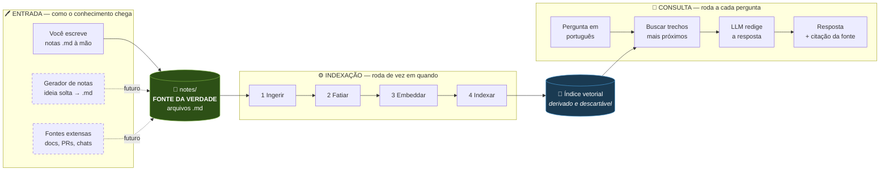
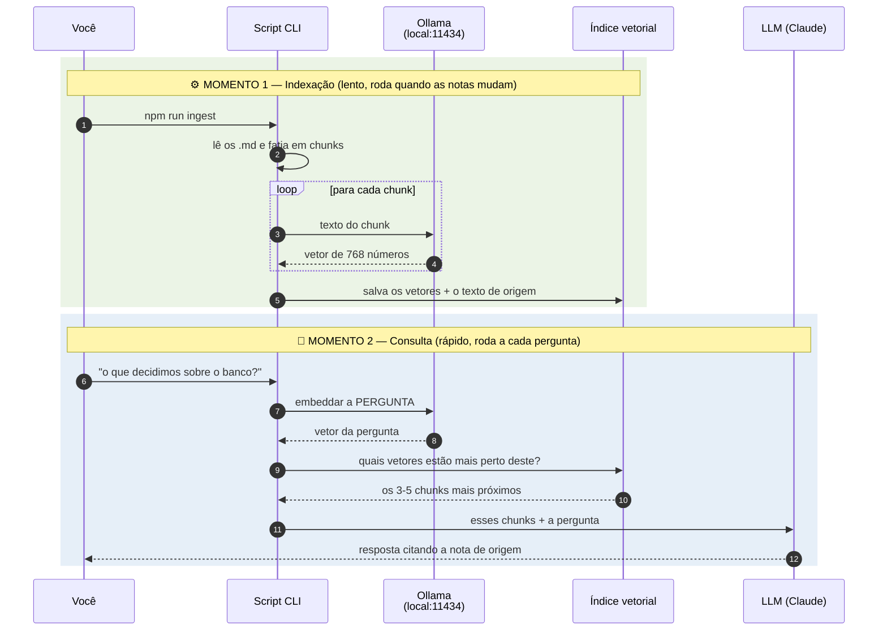
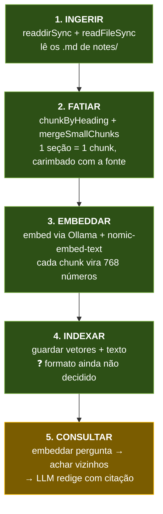
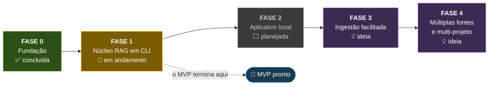
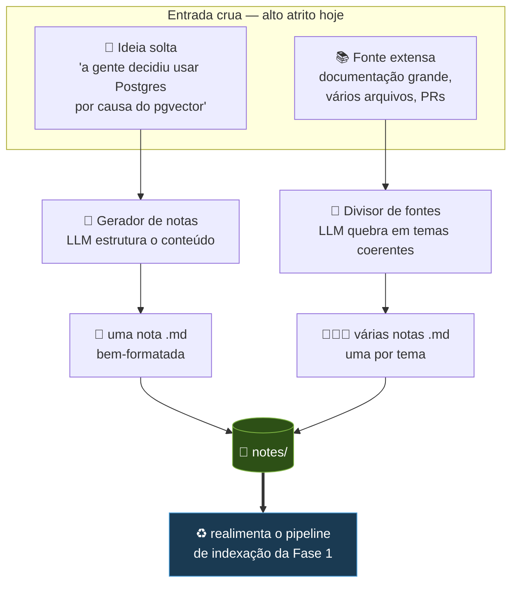

# Mapa arquitetural — dev-second-brain

Visão geral do sistema: o que já existe, o que é o MVP, e para onde ele cresce.
Complementa o `docs/mvp.md` (que guarda as **decisões** e o porquê de cada uma);
aqui o foco é o **desenho** — como as peças se encaixam.

_Última atualização: 2026-08-11_

---

## 1. A ideia central em uma frase

> **Os arquivos `.md` são a fonte da verdade. Todo o resto é derivado deles.**

Essa é a decisão de arquitetura mais importante do projeto (o "Caminho C — híbrido"
registrado no `mvp.md`), e vale entender o peso dela: se amanhã você apagar o índice
vetorial inteiro, **não perdeu nada** — é só reconstruir a partir das notas. Se apagar
as notas, perdeu tudo. Isso mantém seus dados portáteis, legíveis por humanos,
versionáveis com git e independentes de qualquer banco, modelo ou fornecedor.

---

## 2. Mapa geral do sistema

As três grandes zonas: como o conhecimento **entra**, como ele é **preparado** para
busca, e como ele é **consultado**.



**O que ler nesse desenho:**

- O **MVP é só o miolo**: `notes/` → indexação → consulta. As caixas tracejadas da
  esquerda são a "outra metade" do sistema (seção 6), que fica para depois.
- **Indexação e consulta são dois programas diferentes**, que rodam em momentos
  diferentes. Isso não é detalhe — é o conceito que faz o RAG ser viável. Veja a seguir.

---

## 3. Os dois tempos: indexação vs. consulta

Um erro comum de quem está aprendendo RAG é imaginar que a busca lê as notas na hora
da pergunta. **Não lê.** O trabalho pesado acontece antes, uma vez só.



**Por que isso importa:** embeddar 200 chunks pode levar um minuto. Se isso acontecesse
a cada pergunta, a ferramenta seria inutilizável. Como o embedding é **determinístico**
(mesmo texto → sempre o mesmo vetor), dá para calcular uma vez e reaproveitar para
sempre — só refazendo quando as notas mudarem.

Repare também que a **pergunta passa pelo mesmo modelo de embedding** que os chunks.
Tem que ser o mesmo: só assim pergunta e resposta caem no mesmo "mapa" e a distância
entre elas significa alguma coisa.

---

## 4. O pipeline do MVP em detalhe — e onde estamos



| | Passo | Estado | O que existe hoje em `src/ingest.ts` |
|---|---|---|---|
| ✅ | 1. Ingerir | **Concluído** | Lê `notes/`, filtra `.md`, carrega o conteúdo |
| ✅ | 2. Fatiar | **Concluído** | `chunkByHeading` corta em títulos; `mergeSmallChunks` funde os menores que 120 caracteres; cada chunk recebe `Fonte: <nota>` |
| ✅ | 3. Embeddar | **Concluído** | `src/embed.ts` chama o Ollama com **bge-m3** (1024 dimensões) |
| ✅ | 4. Indexar | **Concluído** | `src/store.ts` salva em `data/index.json`, implementa `cosineSimilarity` e `search` por varredura linear |
| 🔸 | 5. Consultar | **Em andamento** | `npm run ask -- "pergunta"` já recupera os trechos certos; **falta o LLM redigir a resposta citando a fonte** |

### Módulos hoje

| Arquivo | Responsabilidade |
|---|---|
| `src/ingest.ts` | Passos 1–4: lê `notes/`, fatia, embedda, salva |
| `src/embed.ts` | Texto → vetor, via Ollama |
| `src/indexer.ts` | Pipeline de indexação como **módulo chamável** — usado pelo CLI e pelo servidor MCP |
| `src/notes.ts` | Criação de notas a partir de conversa: slug seguro e escrita restrita ao vault |
| `src/vaults.ts` | **Registro de vaults**: quais pastas alimentam cada projeto; varredura recursiva de `.md` |
| `src/concurrency.ts` | Pool de trabalhadores para embeddar em paralelo com pressão controlada |
| `src/store.ts` | **Fronteira de armazenamento**: salvar, carregar, hash, cache de embeddings, similaridade, busca |
| `src/ask.ts` | CLI de busca: recebe a pergunta e mostra os trechos mais próximos |
| `src/mcp-server.ts` | **Servidor MCP**: expõe `list_vaults` e `search_notes` ao Claude Code |

`store.ts` existe justamente para que trocar JSON por outra coisa no futuro seja
reescrever um arquivo só — o resto do sistema não sabe onde os dados moram.

---

## 5. Roadmap por fases



### Fase 0 — Fundação ✅ concluída

Repositório, documentação, ADRs, notas de exemplo do projeto fictício "TaskFlow"
(os dados de teste do RAG) e o ambiente Node/TypeScript com `tsx` e ESM.

**Não resta nada.**

### Fase 1 — Núcleo RAG em CLI 🔸 em andamento

O MVP propriamente dito: uma pasta → um índice → uma pergunta → uma resposta com fonte.

**Concluído:**

- [x] **Passo 3** — `embed()` rodando em todos os chunks
- [x] **Passo 4** — índice persistido em `data/index.json`
- [x] **Passo 4** — similaridade de cosseno e busca dos *k* vizinhos, escritas à mão
- [x] **Passo 5** — `npm run ask` embedda a pergunta e recupera os trechos certos
- [x] Código separado em módulos (`embed.ts`, `store.ts`, `ask.ts`)
- [x] **Separação por vault** — cada subpasta de `notes/` vira um índice próprio em
      `data/vaults/<nome>.json`. `npm run ask -- --vault <nome> "pergunta"` limita o
      escopo; sem a flag, cruza todos e etiqueta a origem de cada resultado.
- [x] **Indexação incremental** — cada chunk carrega um hash SHA-256 do texto; só o que
      mudou é re-embeddado. Reindexar sem mudanças: **13,8s → 0,0s**. Editar uma nota:
      **0,5s**. O arquivo grava o modelo usado e descarta o cache inteiro se ele mudar,
      porque vetores de modelos diferentes não são comparáveis.

- [x] **Passo 5** — servidor MCP (`src/mcp-server.ts`) expõe a busca ao Claude Code,
      que passa a ser quem redige. Sem chave de API. Registrado em `.mcp.json`
      (escopo de projeto). Handshake e chamada de ferramenta validados na mão.

**O que resta:**

- [x] **Passo 5 validado em uso real** — o Claude Code chama `search_notes` e responde
      citando a nota. **MVP concluído em 2026-08-11.**
- [x] **Escopo de usuário** — registrado via `claude mcp add -s user`, disponível de
      qualquer pasta. O `.mcp.json` de projeto foi removido para não haver duas
      definições do mesmo servidor (escopo de projeto tem precedência e mascararia
      uma falha no global). Caminhos ancorados em `import.meta.dirname` — sem isso, o
      servidor iniciado de outra pasta procuraria o índice no lugar errado e devolveria
      vazio **sem erro**.
- [ ] **Conjunto de avaliação** — hoje a qualidade da busca é julgada por perguntas
      inventadas na hora. Montar uma lista de perguntas com a nota correta esperada,
      para medir de verdade quando algo mudar.

### Fase 2 — Aplicativo local ⬜ planejada

_Direção definida em 2026-08-11: **aplicativo instalado na máquina, não app web.**_

Trocar o terminal por uma tela: campo de pergunta, resposta com as fontes clicáveis.
O núcleo da Fase 1 vira uma biblioteca chamada pela interface — **a lógica não muda, só
quem aciona**. Foi por isso que se escolheu TypeScript desde o início.

**Caminho escolhido: servidor local + navegador.** Next.js roda na própria máquina,
acessado em `localhost`; vira "instalável" com um serviço systemd de usuário, um arquivo
`.desktop` e um atalho no Hyprland. Custo tecnológico próximo de zero, e um dia dá para
embrulhar a mesma app em Electron se quiser janela própria.

Alternativas consideradas e descartadas: **Electron** agora (pesado demais para o
estágio), **Tauri** (exigiria Rust no meio de um projeto sobre RAG) e **TUI**
(interface de terminal — boa, mas o código de UI não se reaproveita depois).

**Por que isso importa mais do que parece:** um aplicativo instalado é um **processo de
longa duração**. Ele carrega o índice uma vez ao abrir e o mantém na memória o dia
inteiro — cada pergunta custa milissegundos, sem disco nem rede. Um servidor web
precisaria recarregar tudo a cada requisição, e é *só por isso* que um banco de dados
seria necessário. **Com app local, o Postgres sai do roadmap.**

Fecha também a coerência do projeto: notas locais, embeddings locais, índice local e
agora interface local. Nada sai da máquina, funciona offline, sem conta e sem
mensalidade.

**O que resta:** projeto Next.js, camada sobre o núcleo, UI de busca, streaming da
resposta, empacotamento como serviço de usuário, e um atalho global de "pergunta rápida"
no estilo launcher.

### Registro de vaults e comportamento em escala real _(2026-08-11)_

**As notas não precisam morar neste repositório.** O `vaults.json` declara, para cada
vault, quais pastas o alimentam — podendo apontar para a documentação de outro projeto,
que continua sendo editada e versionada onde sempre esteve. Só o índice derivado mora
aqui. Um vault pode ter **várias fontes**, o que permite combinar a documentação oficial
de um projeto com anotações privadas que não vão para o repositório do trabalho.

Pastas precisam ser declaradas de propósito: varrer o disco atrás de markdown indexaria
README de dependência e changelog gerado, derrubando a qualidade da busca.

**Números com um projeto real** (93 arquivos, ~175 mil palavras):

| Medida | Valor |
|---|---|
| Chunks gerados | 1.543 |
| Primeira indexação | 28 min (~1,1s por chunk) |
| Reindexação sem mudanças | 0,6s |
| Índice em disco | 32 MB |
| Busca no vault | 0,9s |
| Busca cruzada nos 3 vaults (1.596 chunks) | 0,65s |
| Controle (assunto ausente) | 0,373 contra 0,568 de um acerto |

Mesmo com o projeto grande representando **97% do índice**, a busca cruzada continua
trazendo as notas certas dos vaults pequenos: volume não afoga relevância.

### O que os dados reais quebraram

Três defeitos que só apareceram fora do conjunto de exemplo:

1. **Paralelismo rende 1,5×, não 4×.** Embeddar é limitado por CPU, não por espera de
   rede — um único embedding já ocupa todos os núcleos, então não há ociosidade para
   preencher. Medido: concorrência 4 é o ponto ótimo; acima de 8 a disputa piora tudo.
   _Paralelismo só acelera o que está esperando._
2. **O fatiador não sabia dividir.** Havia mínimo, não havia máximo. Seções sem
   subtítulo (cronogramas, tabelas longas) geraram chunks de até 21 mil caracteres, que
   estouram a janela do modelo — o Ollama responde 500. Agora existe
   `MAX_CHUNK_LENGTH = 2000`, quebrando em fronteiras de parágrafo e repetindo o título
   da seção em cada pedaço. Também melhora a busca: um vetor para 20 páginas vira uma
   média sem foco.
3. **Um chunk ruim derrubava a indexação inteira.** 1.333 trechos válidos eram perdidos
   por causa de 1 problemático. Agora a falha é registrada, o trecho é pulado e o índice
   é salvo.

E um defeito de configuração: o `tsconfig.json` tinha `"types": []`, que desliga todos
os pacotes de tipos globais — o `@types/node` estava instalado e ignorado desde o
início. Como o `tsx` não checa tipos, nada reclamava. Corrigido; use `npm run typecheck`.

### Fase 3 — Ingestão facilitada 💡 ideia

A "outra metade" do sistema — ver seção 6.

### Fase 4 — Múltiplas fontes e multi-projeto 💡 ideia

GitHub (PRs, issues, commits), conversas com LLMs, chats de equipe; reindexação
automática conforme o projeto evolui; e isolamento por projeto — um "vault" por
contexto, para uma pergunta sobre o projeto A não trazer trechos do projeto B.

---

## 6. A outra metade: ingestão facilitada (Fase 3)

Esta é a parte que você comentou e que vale destacar, porque é **simétrica** ao MVP:

- O **MVP** resolve a metade de **leitura**: markdown que já existe → respostas.
- A **Fase 3** resolve a metade de **escrita**: informação crua → markdown bem-formatado.

O gargalo real de um segundo cérebro nunca é a consulta — é a **captura**. Notas só
existem se escrevê-las for barato. Foi por isso, aliás, que as notas em markdown
venceram conversas e GitHub como primeira fonte: menor atrito.



**O ciclo fecha:** quanto mais fácil escrever notas, mais notas existem; quanto mais
notas, mais útil fica a busca; quanto mais útil a busca, mais vale a pena escrever.
Mas repare que o gerador **só faz sentido depois que a consulta funciona** — gerar
notas que ninguém consegue consultar não resolve problema nenhum. Por isso a ordem
das fases é essa, e não o contrário.

**Perguntas de design ainda em aberto para essa fase:** o gerador nomeia os arquivos
como? Deduplica quando você registrar a mesma decisão duas vezes? Usa front-matter
com tags e data? Nada disso precisa de resposta agora — mas ficam anotadas.

---

## 7. Decisões tomadas e o que ainda falta decidir

### ✅ Passo 4 — onde guardar os vetores: **arquivo JSON**

Escolhido em 2026-08-11. Zero dependências, os dados são inspecionáveis a olho nu, e a
similaridade fica escrita à mão — que é o conceito central a aprender. Descartados:
SQLite vetorial (esconderia a matemática atrás de uma query) e Postgres + pgvector
(subir um banco para 12 chunks).

A decisão é barata de reverter: o índice é derivado das notas, então migrar significa
apagar `data/index.json`, reescrever `src/store.ts` e reindexar.

### ✅ Modelo de embedding: **bge-m3**, substituindo o nomic-embed-text

Trocado em 2026-08-11, depois de a busca falhar na prática. O `nomic-embed-text` é
treinado essencialmente em inglês e, com notas em português, produzia vetores que quase
não se distinguiam: tudo espremido entre 0,41 e 0,67, e uma pergunta sobre *bolo de
cenoura* pontuava 0,62 — mais que a maioria dos trechos legítimos.

| | nomic-embed-text | bge-m3 |
|---|---|---|
| Pergunta sobre a interface | resposta certa em **13º de 15** | resposta certa em **1º** |
| Pergunta sem relação (controle) | 0,624 | **0,256** |
| Dimensões | 768 | 1024 |

Hipóteses testadas e **descartadas** antes de chegar ao modelo: prefixos de tarefa
(`search_query:` / `search_document:`) e remoção do carimbo `Fonte:` — nenhuma das duas
mudou o ranking. Vale registrar que foram medidas, não supostas.

> ⚠️ **Trocar o modelo de embedding invalida o índice inteiro** — vetores de modelos
> diferentes não são comparáveis. Esta é a decisão realmente cara do projeto, e é por
> isso que ela foi testada cedo, com 15 chunks e 4 segundos de reindexação, em vez de
> depois de dois anos de notas acumuladas.

### ✅ Passo 5 — quem redige a resposta: **o próprio Claude Code, via servidor MCP**

Decidido em 2026-08-11. Em vez de escolher entre a API do Claude (paga, exige chave) e
um modelo local no Ollama (grátis, mas escreve pior), o projeto expõe a busca como uma
**ferramenta MCP** e deixa o Claude Code — que o Heitor já usa no terminal — fazer a
redação.

```
Claude Code (em qualquer projeto)
      ↓ MCP
  search_notes(pergunta, vault?)
      ↓
  store.ts  →  índice do vault  →  Ollama (embedda a pergunta)
```

**O que isso resolve:** nenhuma chave de API, nenhum custo além da assinatura já paga,
e — registrando o servidor em escopo de usuário — o vault fica consultável de dentro de
qualquer pasta onde o Claude Code abrir. Também **torna a Fase 2 opcional**: a
ferramenta fica usável sem app nenhum.

**Por que o RAG continua necessário:** o Claude Code sozinho lê a pasta e responde — o
que funciona com 4 notas e quebra com 2.000, porque estoura o contexto e o `Grep` só
acha palavra literal. O servidor dá a ele a habilidade que falta: escolher **quais** 5
trechos merecem entrar no contexto, por significado.

**Custos assumidos:** a redação final exige internet, e os trechos recuperados saem da
máquina (o que já acontece ao usar o Claude Code neste repo). Embeddings e busca seguem
locais. O `npm run ask` continua funcionando offline, devolvendo trechos crus.

### Gatilhos de migração — o que fazer quando doer

Anotado para não decidir no escuro depois. A ordem é a ordem em que os problemas
realmente aparecem:

| Sintoma | Solução | Quando |
|---|---|---|
| ~~Reindexar demora minutos~~ | ~~Indexação incremental~~ | ✅ **feito em 2026-08-11** |
| ~~Respostas misturam projetos diferentes~~ | ~~Um índice por projeto~~ | ✅ **feito em 2026-08-11** |
| `JSON.parse` passa de ~2s por consulta | SQLite vetorial | 🟡 lá pelos 10 mil chunks **de um mesmo vault** |
| — | ~~Postgres + pgvector~~ | ❌ removido: o app local não precisa |

> Com vaults separados, o teto do JSON passou a valer **por projeto**, não no total.
> Um projeto individual dificilmente chega a 10 mil chunks, o que empurra a migração
> para um futuro bem distante.

---

## 8. Catálogo de melhorias — o backlog vivo

Agrupado pelo **problema que cada ideia resolve**, não pela ordem em que surgiram.
Marque como concluído conforme forem saindo.

### 🔓 Alcance — a ferramenta existir onde se trabalha

| | Ideia | O que é | Esforço |
|---|---|---|---|
| ✅ | Escopo de usuário | Servidor MCP global, consultável de qualquer pasta | — |
| ✅ | Registro de vaults | `vaults.json` apontando para pastas de outros projetos | — |
| ⬜ | Vault automático pelo contexto | Deduzir o projeto pelo diretório ou repositório e assumir o vault correspondente | 🟢 pequeno |

### ✍️ Captura — o gargalo real de um segundo cérebro

Notas só existem se escrevê-las for barato. Uma ferramenta de consulta sem captura
fácil morre vazia.

| | Ideia | O que é | Esforço |
|---|---|---|---|
| ✅ | **`save_note` via MCP** | Feito em 2026-08-12. Conversando: _"anota que decidimos X porque Y"_ → `.md` formatado no vault certo, indexado na hora. É o "gerador de notas" idealizado no começo, sem precisar de app. O vault declara `writeTo`; sem isso a escrita é **recusada**, para uma anotação pessoal nunca cair no repositório de trabalho de um cliente. Título vira nome de arquivo com sanitização contra *path traversal* | — |
| ⬜ | Captura de fim de sessão | Ao terminar um trabalho, resumir as decisões tomadas e perguntar _"registro isso?"_ | 🟡 médio |
| ⬜ | Ingestão de fontes extensas | Apontar para documentação grande e quebrar em várias notas temáticas | 🟠 grande |
| ⬜ | Captura a partir do git | Gerar notas de "o que mudou e por quê" a partir de commits e PRs. _Ressalva: commit não é decisão; tende a gerar muita nota de baixo valor_ | 🟠 grande |

### 🔄 Frescor — o índice nunca mentir

| | Ideia | O que é | Esforço |
|---|---|---|---|
| ✅ | **Índice em memória + invalidação por mtime** | Feito em 2026-08-11. Busca repetida no mesmo processo caiu de **155ms para 4ms**; editar uma nota e perguntar em seguida reindexa sozinho em 0,5s | — |
| ⬜ | Ferramenta `reindex` no MCP | Disparar reindexação completa conversando, sem ir ao terminal | 🟢 trivial |

### 🎯 Qualidade da recuperação

| | Ideia | O que é | Esforço |
|---|---|---|---|
| ⬜ | **Conjunto de avaliação** ⭐ | Perguntas com a nota correta esperada + script que pontua. Sem isso, toda mudança na busca é chute — hoje a qualidade é julgada por impressão | 🟡 médio |
| ⬜ | Busca híbrida | Combinar semântica com palavra exata. A semântica é fraca justamente em identificadores: nomes de função, códigos de erro, siglas, nomes próprios | 🟡 médio |
| ✅ | Teto de tamanho de chunk | Evita o vetor-média sem foco e o estouro de contexto | — |
| ⬜ | Contexto hierárquico completo | Hoje o chunk carrega o nome do arquivo e o título da seção. Incluir o caminho inteiro de títulos (`Decisão banco > Alternativas > MongoDB`) | 🟢 pequeno |
| ⬜ | Reranking | Recuperar 20 e reordenar com modelo mais caro antes de entregar 5. _Complexidade alta para ganho marginal no volume atual_ | 🟠 grande |

### 🧭 Confiança — saber se dá para acreditar

| | Ideia | O que é | Esforço |
|---|---|---|---|
| ⬜ | Front-matter nas notas | Data, projeto, tags, status → habilita filtros que a busca semântica não sabe fazer (_"o que decidimos em julho?"_ é pergunta de data, não de significado) | 🟡 médio |
| ⬜ | Decisões substituídas | Marcar quando uma decisão foi revista, e a busca avisar _"superado por [[outra-nota]]"_. Já há um caso real no vault: o `nomic-embed-text` | 🟡 médio |
| ⬜ | Peso por recência | Uma decisão de ontem vale mais que uma de dois anos atrás, mesmo combinando pior com as palavras | 🟢 pequeno |

### Ordem recomendada

O critério é **o que destrava as outras coisas**, não o que é mais interessante:

1. ~~Escopo de usuário~~ ✅ — sem isso a ferramenta não existe fora deste repo
2. ~~Índice em memória + invalidação~~ ✅ — pré-requisito da captura: nota salva precisa ficar buscável no segundo seguinte
3. ~~`save_note`~~ ✅ — fecha o ciclo: conversa → nota → memória consultável
4. **Conjunto de avaliação** ⬅️ **próximo** — antes de mexer na qualidade da busca, é preciso saber medi-la
5. Depois: contexto hierárquico e peso por recência (pequenos, bom retorno), front-matter, busca híbrida

## 9. Onde retomar

O ponto exato do trabalho vive na seção **"Estado atual"** do `docs/mvp.md` —
é o arquivo a abrir no início de cada sessão. Este mapa é a visão de cima;
o `mvp.md` é o "você está aqui".
