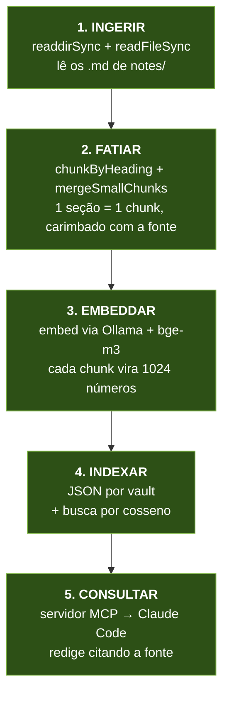
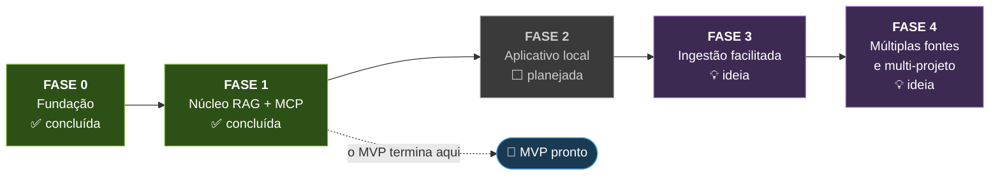
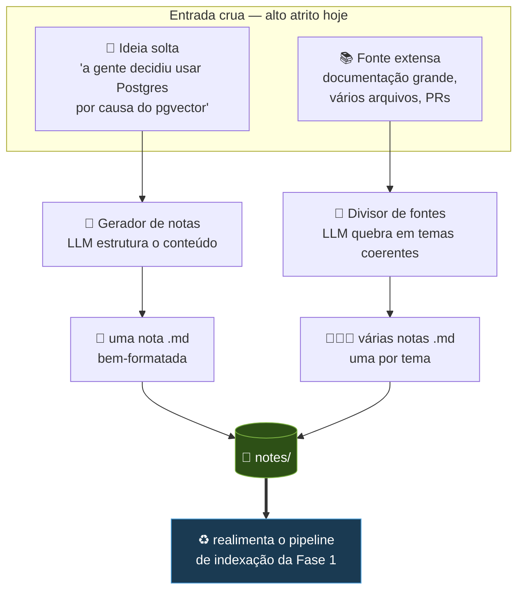

# Mapa arquitetural — dev-second-brain

Visão geral do sistema: o que já existe, o que é o MVP, e para onde ele cresce.
Complementa o `docs/mvp.md` (que guarda as **decisões** e o porquê de cada uma);
aqui o foco é o **desenho** — como as peças se encaixam.

_Última atualização: 2026-08-13_

---

## 0. Onde estamos — painel

> **Situação: Fase 1 concluída.** A ferramenta é usável no dia a dia, de dentro de
> qualquer projeto. Não estamos na Fase 2 — estamos num **intervalo de consolidação**,
> em que o trabalho é qualidade e captura, não interface nova.

```mermaid
flowchart LR
    subgraph FEITO["✅ CONCLUÍDO"]
        direction TB
        E1["MVP: pipeline RAG<br/>de 5 passos"]
        E2["Servidor MCP<br/>escopo de usuário"]
        E3["Vaults por projeto<br/>+ registro conversacional"]
        E4["Captura por conversa<br/>save_note"]
        E5["Indexação incremental<br/>+ frescor automático"]
        E6["Suíte de avaliação<br/>39 perguntas, 3 vaults"]
        E7["Recuperação em<br/>Recall@5 de 97%"]
        E8["Front-matter:<br/>filtro por data e<br/>decisões revistas"]
    end

    AGORA["🎯 <b>AGORA</b><br/>Captura de<br/>fim de sessão"]

    subgraph PROXIMOS["⏭️ PRÓXIMOS — qualidade e confiança"]
        direction TB
        P2["Contexto hierárquico<br/>no chunk"]
        P4["Peso por recência"]
    end

    subgraph DEPOIS["🔭 DEPOIS — alcance e captura"]
        direction TB
        D1["Vault automático<br/>pelo diretório"]
        D3["Ingestão de<br/>fontes extensas"]
        D4["FASE 2<br/>aplicativo local"]
    end

    FEITO --> AGORA --> PROXIMOS --> DEPOIS

    classDef feito fill:#2d5016,stroke:#7cb342,color:#fff
    classDef agora fill:#7a5c00,stroke:#ffc107,color:#fff
    classDef proximo fill:#1a3a52,stroke:#4a9eda,color:#fff
    classDef depois fill:#3d2a52,stroke:#a06fd6,color:#fff

    class E1,E2,E3,E4,E5,E6,E7,E8 feito
    class AGORA agora
    class P2,P4 proximo
    class D1,D3,D4 depois
```



### 🎯 O procedimento a executar agora

**Captura de fim de sessão** — fechar a última lacuna da frente que ainda limita a
ferramenta de verdade.

Por que esta e não outra: das seis frentes, **captura é a única ainda parcial** que
depende de comportamento, não de infraestrutura. O `save_note` funciona, mas exige que
alguém lembre de pedir. Na prática, decisões são tomadas no meio do trabalho e o
registro fica para depois — que nunca chega.

A ideia: ao terminar um trabalho, o Claude resume as decisões tomadas na conversa e
oferece registrá-las. Transforma conversa em memória **sem depender de disciplina**.

O que fazer, em ordem:

1. Definir o gatilho. Provavelmente instrução no `CLAUDE.md` do projeto, como o bloco
   que o `add_vault` já sugere — não uma ferramenta nova.
2. Refinar o critério do que merece nota: decisão com justificativa, não mudança de
   código. Nota demais afoga a busca tanto quanto nota de menos.
3. Testar em uso real por alguns dias e ver quantas notas de valor surgem.

**Como medir:** esta é a primeira melhoria da série que a suíte de avaliação **não
consegue avaliar** — ela mede recuperação, não captura. A métrica aqui é o crescimento
do vault com notas que você releria. Vale reconhecer isso em vez de fingir que o número
existe.

> **Regra ao escrever perguntas novas:** nunca cite o texto dos controles negativos na
> documentação. O vault `dev-second-brain` indexa `docs/`, e isso já contaminou a suíte
> uma vez (seção 8).

### Estado por frente

| Frente | Estado | Detalhe |
|---|---|---|
| 🔓 **Alcance** | ✅ resolvido | MCP global; vaults apontam para qualquer pasta; `add_vault` por conversa |
| ✍️ **Captura** | 🟡 parcial | `save_note` funciona e já gera front-matter, mas exige que alguém lembre de pedir. Faltam captura de fim de sessão e ingestão de fontes extensas |
| 🔄 **Frescor** | ✅ resolvido | Índice em memória + reindexação automática por data de modificação |
| 🎯 **Qualidade** | ✅ perto do teto | Recall@5 97%; a única falha é uma pergunta de contagem. Busca lexical e expansão por grafo foram construídas, medidas e **desligadas** — nenhuma melhorou |
| 🧭 **Confiança** | ✅ resolvido | Front-matter com data e status; filtro `since`/`until`; decisões revistas saem com alerta nomeando a substituta |
| 🖥️ **Interface** | ⬜ adiada | Fase 2 virou opcional: o Claude Code já é a interface |

### O que NÃO fazer agora

- **Fase 2 (aplicativo local).** Deixou de ser necessária quando o Claude Code virou a
  interface. Construir tela agora é adiar o que realmente limita a ferramenta.
- **Trocar o armazenamento.** JSON aguenta muito além do volume atual; os gatilhos de
  migração estão na seção 7.
- **Reranking.** Complexidade alta para ganho marginal neste volume.
- **Reativar busca lexical ou expansão por grafo sem medir.** Ambas foram desligadas com
  dado (seção 8). Religar é `LEXICAL_WEIGHT=0.3` ou `GRAPH_BOOST=0.05` + `npm run eval`
  e comparar — não editar o padrão por intuição.
- **Mais ajuste fino na recuperação.** Recall@5 está em 97% e duas tentativas seguidas
  falharam. O retorno está na captura, não na busca.
- **Peso por recência.** A ordenação natural já coloca a decisão vigente acima da revista
  sem ajuda (seção 8), e a penalidade testada só piorou. Sem problema medido, sem solução.
- **Captura a partir do git.** Commit não é decisão; geraria ruído que afoga as notas boas.

---

## 1. A ideia central em uma frase

> **Os arquivos `.md` são a fonte da verdade. Todo o resto é derivado deles.**

Essa é a decisão de arquitetura mais importante do projeto (o "Caminho C — híbrido"
registrado no `mvp.md`), e vale entender o peso dela: se amanhã você apagar o índice
vetorial inteiro, **não perdeu nada** — é só reconstruir a partir das notas. Se apagar
as notas, perdeu tudo. Isso mantém seus dados portáteis, legíveis por humanos,
versionáveis com git e independentes de qualquer banco, modelo ou fornecedor.

---

## 2. Mapa geral do sistema

As três grandes zonas: como o conhecimento **entra**, como ele é **preparado** para
busca, e como ele é **consultado**.


**O que ler nesse desenho:**

- O **MVP é só o miolo**: notas → indexação → consulta. As caixas tracejadas da
  esquerda são a "outra metade" do sistema (seção 6), que fica para depois.
- **Indexação e consulta são dois programas diferentes**, que rodam em momentos
  diferentes. Isso não é detalhe — é o conceito que faz o RAG ser viável. Veja a seguir.

---

## 3. Os dois tempos: indexação vs. consulta

Um erro comum de quem está aprendendo RAG é imaginar que a busca lê as notas na hora
da pergunta. **Não lê.** O trabalho pesado acontece antes, uma vez só.

```mermaid
sequenceDiagram
    autonumber
    participant Você
    participant App as CLI / servidor MCP
    participant Ollama as Ollama<br/>(local:11434)
    participant Idx as Índice vetorial
    participant LLM as LLM (Claude)

    rect rgba(120, 180, 90, 0.15)
    Note over Você,Idx: ⚙️ MOMENTO 1 — Indexação (lenta; automática quando as notas mudam)
    Você->>App: npm run ingest
    App->>App: lê os .md e fatia em chunks
    loop para cada chunk
        App->>Ollama: texto do chunk
        Ollama-->>App: vetor de 1024 números
    end
    App->>Idx: salva os vetores + o texto de origem
    end

    rect rgba(90, 150, 210, 0.15)
    Note over Você,LLM: 💬 MOMENTO 2 — Consulta (rápido, roda a cada pergunta)
    Você->>App: "o que decidimos sobre o banco?"
    App->>Ollama: embeddar a PERGUNTA
    Ollama-->>App: vetor da pergunta
    App->>Idx: quais vetores estão mais perto deste?
    Idx-->>App: os 3-5 chunks mais próximos
    App->>LLM: esses chunks + a pergunta
    LLM-->>Você: resposta citando a nota de origem
    end
```

**Por que isso importa:** embeddar 200 chunks pode levar um minuto. Se isso acontecesse
a cada pergunta, a ferramenta seria inutilizável. Como o embedding é **determinístico**
(mesmo texto → sempre o mesmo vetor), dá para calcular uma vez e reaproveitar para
sempre — só refazendo quando as notas mudarem.

Repare também que a **pergunta passa pelo mesmo modelo de embedding** que os chunks.
Tem que ser o mesmo: só assim pergunta e resposta caem no mesmo "mapa" e a distância
entre elas significa alguma coisa.

---

## 4. O pipeline do MVP em detalhe — e onde estamos



| | Passo | Estado | O que existe hoje |
|---|---|---|---|
| ✅ | 1. Ingerir | **Concluído** | `src/vaults.ts` resolve as pastas de cada vault e varre `.md` recursivamente |
| ✅ | 2. Fatiar | **Concluído** | Corta em títulos, funde os menores que 120 caracteres, divide os maiores que 2.000; cada chunk recebe `Fonte: <nota>` |
| ✅ | 3. Embeddar | **Concluído** | `src/embed.ts` chama o Ollama com **bge-m3** (1024 dimensões), em paralelo e só o que mudou |
| ✅ | 4. Indexar | **Concluído** | `src/store.ts` salva em `data/vaults/<vault>.json`; busca híbrida (cosseno + BM25, fusão RRF) por varredura linear |
| ✅ | 5. Consultar | **Concluído** | `src/mcp-server.ts` expõe a busca ao Claude Code, que redige citando a fonte. `npm run ask` serve para depuração |

### Módulos hoje

| Arquivo | Responsabilidade |
|---|---|
| `src/ingest.ts` | CLI de indexação — casca fina sobre `indexer.ts` |
| `src/embed.ts` | Texto → vetor, via Ollama |
| `src/eval.ts` | Avaliação da qualidade da busca (`npm run eval`) |
| `src/indexer.ts` | Pipeline de indexação como **módulo chamável** — usado pelo CLI e pelo servidor MCP |
| `src/notes.ts` | Criação de notas a partir de conversa: slug seguro e escrita restrita ao vault |
| `src/vaults.ts` | **Registro de vaults**: quais pastas alimentam cada projeto; varredura recursiva de `.md` |
| `src/concurrency.ts` | Pool de trabalhadores para embeddar em paralelo com pressão controlada |
| `src/lexical.ts` | Busca lexical (BM25 + RRF) — implementada, desligada por medição |
| `src/links.ts` | Expansão por grafo (links entre notas) — implementada, desligada por medição |
| `src/frontmatter.ts` | Metadados das notas: data, status, decisões substituídas |
| `src/store.ts` | **Fronteira de armazenamento**: salvar, carregar, hash, caches, similaridade e busca híbrida |
| `src/ask.ts` | CLI de busca: recebe a pergunta e mostra os trechos mais próximos |
| `src/mcp-server.ts` | **Servidor MCP**: expõe `list_vaults`, `search_notes`, `save_note` e `add_vault` ao Claude Code |

`store.ts` existe justamente para que trocar JSON por outra coisa no futuro seja
reescrever um arquivo só — o resto do sistema não sabe onde os dados moram.

---

### Registro de vaults e comportamento em escala real _(2026-08-11)_

**As notas não precisam morar neste repositório.** O `vaults.json` declara, para cada
vault, quais pastas o alimentam — podendo apontar para a documentação de outro projeto,
que continua sendo editada e versionada onde sempre esteve. Só o índice derivado mora
aqui. Um vault pode ter **várias fontes**, o que permite combinar a documentação oficial
de um projeto com anotações privadas que não vão para o repositório do trabalho.

Pastas precisam ser declaradas de propósito: varrer o disco atrás de markdown indexaria
README de dependência e changelog gerado, derrubando a qualidade da busca.

**Números com um projeto real** (93 arquivos, ~175 mil palavras):

| Medida | Valor |
|---|---|
| Chunks gerados | 1.543 |
| Primeira indexação | 28 min (~1,1s por chunk) |
| Reindexação sem mudanças | 0,6s |
| Índice em disco | 32 MB |
| Busca no vault | 0,9s |
| Busca cruzada nos 3 vaults (1.596 chunks) | 0,65s |
| Controle (assunto ausente) | 0,373 contra 0,568 de um acerto |

Mesmo com o projeto grande representando **97% do índice**, a busca cruzada continua
trazendo as notas certas dos vaults pequenos: volume não afoga relevância.

### O que os dados reais quebraram

Três defeitos que só apareceram fora do conjunto de exemplo:

1. **Paralelismo rende 1,5×, não 4×.** Embeddar é limitado por CPU, não por espera de
   rede — um único embedding já ocupa todos os núcleos, então não há ociosidade para
   preencher. Medido: concorrência 4 é o ponto ótimo; acima de 8 a disputa piora tudo.
   _Paralelismo só acelera o que está esperando._
2. **O fatiador não sabia dividir.** Havia mínimo, não havia máximo. Seções sem
   subtítulo (cronogramas, tabelas longas) geraram chunks de até 21 mil caracteres, que
   estouram a janela do modelo — o Ollama responde 500. Agora existe
   `MAX_CHUNK_LENGTH = 2000`, quebrando em fronteiras de parágrafo e repetindo o título
   da seção em cada pedaço. Também melhora a busca: um vetor para 20 páginas vira uma
   média sem foco.
3. **Um chunk ruim derrubava a indexação inteira.** 1.333 trechos válidos eram perdidos
   por causa de 1 problemático. Agora a falha é registrada, o trecho é pulado e o índice
   é salvo.

E um defeito de configuração: o `tsconfig.json` tinha `"types": []`, que desliga todos
os pacotes de tipos globais — o `@types/node` estava instalado e ignorado desde o
início. Como o `tsx` não checa tipos, nada reclamava. Corrigido; use `npm run typecheck`.

---

## 5. Roadmap por fases



### Fase 0 — Fundação ✅ concluída

Repositório, documentação, ADRs, notas de exemplo do projeto fictício "TaskFlow"
(os dados de teste do RAG) e o ambiente Node/TypeScript com `tsx` e ESM.

**Não resta nada.**

### Fase 1 — Núcleo RAG + servidor MCP ✅ concluída

O MVP propriamente dito: uma pasta → um índice → uma pergunta → uma resposta com fonte.

**Concluído:**

- [x] **Passo 3** — `embed()` rodando em todos os chunks
- [x] **Passo 4** — índice persistido em disco (hoje `data/vaults/<vault>.json`)
- [x] **Passo 4** — similaridade de cosseno e busca dos *k* vizinhos, escritas à mão
- [x] **Passo 5** — `npm run ask` embedda a pergunta e recupera os trechos certos
- [x] Código separado em módulos (`embed.ts`, `store.ts`, `ask.ts`)
- [x] **Separação por vault** — cada subpasta de `notes/` vira um índice próprio em
      `data/vaults/<nome>.json`. `npm run ask -- --vault <nome> "pergunta"` limita o
      escopo; sem a flag, cruza todos e etiqueta a origem de cada resultado.
- [x] **Indexação incremental** — cada chunk carrega um hash SHA-256 do texto; só o que
      mudou é re-embeddado. Reindexar sem mudanças: **13,8s → 0,0s**. Editar uma nota:
      **0,5s**. O arquivo grava o modelo usado e descarta o cache inteiro se ele mudar,
      porque vetores de modelos diferentes não são comparáveis.

- [x] **Passo 5** — servidor MCP (`src/mcp-server.ts`) expõe a busca ao Claude Code,
      que passa a ser quem redige. Sem chave de API. Registrado em `.mcp.json`
      (escopo de projeto). Handshake e chamada de ferramenta validados na mão.

**O que resta:**

- [x] **Passo 5 validado em uso real** — o Claude Code chama `search_notes` e responde
      citando a nota. **MVP concluído em 2026-08-11.**
- [x] **Escopo de usuário** — registrado via `claude mcp add -s user`, disponível de
      qualquer pasta. O `.mcp.json` de projeto foi removido para não haver duas
      definições do mesmo servidor (escopo de projeto tem precedência e mascararia
      uma falha no global). Caminhos ancorados em `import.meta.dirname` — sem isso, o
      servidor iniciado de outra pasta procuraria o índice no lugar errado e devolveria
      vazio **sem erro**.
- [ ] **Conjunto de avaliação** — hoje a qualidade da busca é julgada por perguntas
      inventadas na hora. Montar uma lista de perguntas com a nota correta esperada,
      para medir de verdade quando algo mudar.

### Fase 2 — Aplicativo local ⬜ planejada

_Direção definida em 2026-08-11: **aplicativo instalado na máquina, não app web.**_

Trocar o terminal por uma tela: campo de pergunta, resposta com as fontes clicáveis.
O núcleo da Fase 1 vira uma biblioteca chamada pela interface — **a lógica não muda, só
quem aciona**. Foi por isso que se escolheu TypeScript desde o início.

**Caminho escolhido: servidor local + navegador.** Next.js roda na própria máquina,
acessado em `localhost`; vira "instalável" com um serviço systemd de usuário, um arquivo
`.desktop` e um atalho no Hyprland. Custo tecnológico próximo de zero, e um dia dá para
embrulhar a mesma app em Electron se quiser janela própria.

Alternativas consideradas e descartadas: **Electron** agora (pesado demais para o
estágio), **Tauri** (exigiria Rust no meio de um projeto sobre RAG) e **TUI**
(interface de terminal — boa, mas o código de UI não se reaproveita depois).

**Por que isso importa mais do que parece:** um aplicativo instalado é um **processo de
longa duração**. Ele carrega o índice uma vez ao abrir e o mantém na memória o dia
inteiro — cada pergunta custa milissegundos, sem disco nem rede. Um servidor web
precisaria recarregar tudo a cada requisição, e é *só por isso* que um banco de dados
seria necessário. **Com app local, o Postgres sai do roadmap.**

Fecha também a coerência do projeto: notas locais, embeddings locais, índice local e
agora interface local. Nada sai da máquina, funciona offline, sem conta e sem
mensalidade.

**O que resta:** projeto Next.js, camada sobre o núcleo, UI de busca, streaming da
resposta, empacotamento como serviço de usuário, e um atalho global de "pergunta rápida"
no estilo launcher.

### Fase 3 — Ingestão facilitada 💡 ideia

A "outra metade" do sistema — ver seção 6.

### Fase 4 — Múltiplas fontes e multi-projeto 💡 ideia

GitHub (PRs, issues, commits), conversas com LLMs, chats de equipe; reindexação
automática conforme o projeto evolui; e isolamento por projeto — um "vault" por
contexto, para uma pergunta sobre o projeto A não trazer trechos do projeto B.

---

## 6. A outra metade: ingestão facilitada (Fase 3)

Esta é a parte que você comentou e que vale destacar, porque é **simétrica** ao MVP:

- O **MVP** resolve a metade de **leitura**: markdown que já existe → respostas.
- A **Fase 3** resolve a metade de **escrita**: informação crua → markdown bem-formatado.

O gargalo real de um segundo cérebro nunca é a consulta — é a **captura**. Notas só
existem se escrevê-las for barato. Foi por isso, aliás, que as notas em markdown
venceram conversas e GitHub como primeira fonte: menor atrito.



**O ciclo fecha:** quanto mais fácil escrever notas, mais notas existem; quanto mais
notas, mais útil fica a busca; quanto mais útil a busca, mais vale a pena escrever.
Mas repare que o gerador **só faz sentido depois que a consulta funciona** — gerar
notas que ninguém consegue consultar não resolve problema nenhum. Por isso a ordem
das fases é essa, e não o contrário.

**Perguntas de design ainda em aberto para essa fase:** o gerador nomeia os arquivos
como? Deduplica quando você registrar a mesma decisão duas vezes? Usa front-matter
com tags e data? Nada disso precisa de resposta agora — mas ficam anotadas.

---

## 7. Decisões tomadas e o que ainda falta decidir

### ✅ Passo 4 — onde guardar os vetores: **arquivo JSON**

Escolhido em 2026-08-11. Zero dependências, os dados são inspecionáveis a olho nu, e a
similaridade fica escrita à mão — que é o conceito central a aprender. Descartados:
SQLite vetorial (esconderia a matemática atrás de uma query) e Postgres + pgvector
(subir um banco para 12 chunks).

A decisão é barata de reverter: o índice é derivado das notas, então migrar significa
apagar `data/index.json`, reescrever `src/store.ts` e reindexar.

### ✅ Modelo de embedding: **bge-m3**, substituindo o nomic-embed-text

Trocado em 2026-08-11, depois de a busca falhar na prática. O `nomic-embed-text` é
treinado essencialmente em inglês e, com notas em português, produzia vetores que quase
não se distinguiam: tudo espremido entre 0,41 e 0,67, e uma pergunta sobre *bolo de
cenoura* pontuava 0,62 — mais que a maioria dos trechos legítimos.

| | nomic-embed-text | bge-m3 |
|---|---|---|
| Pergunta sobre a interface | resposta certa em **13º de 15** | resposta certa em **1º** |
| Pergunta sem relação (controle) | 0,624 | **0,256** |
| Dimensões | 768 | 1024 |

Hipóteses testadas e **descartadas** antes de chegar ao modelo: prefixos de tarefa
(`search_query:` / `search_document:`) e remoção do carimbo `Fonte:` — nenhuma das duas
mudou o ranking. Vale registrar que foram medidas, não supostas.

> ⚠️ **Trocar o modelo de embedding invalida o índice inteiro** — vetores de modelos
> diferentes não são comparáveis. Esta é a decisão realmente cara do projeto, e é por
> isso que ela foi testada cedo, com 15 chunks e 4 segundos de reindexação, em vez de
> depois de dois anos de notas acumuladas.

### ✅ Passo 5 — quem redige a resposta: **o próprio Claude Code, via servidor MCP**

Decidido em 2026-08-11. Em vez de escolher entre a API do Claude (paga, exige chave) e
um modelo local no Ollama (grátis, mas escreve pior), o projeto expõe a busca como uma
**ferramenta MCP** e deixa o Claude Code — que o Heitor já usa no terminal — fazer a
redação.

```
Claude Code (em qualquer projeto)
      ↓ MCP
  search_notes(pergunta, vault?)
      ↓
  store.ts  →  índice do vault  →  Ollama (embedda a pergunta)
```

**O que isso resolve:** nenhuma chave de API, nenhum custo além da assinatura já paga,
e — registrando o servidor em escopo de usuário — o vault fica consultável de dentro de
qualquer pasta onde o Claude Code abrir. Também **torna a Fase 2 opcional**: a
ferramenta fica usável sem app nenhum.

**Por que o RAG continua necessário:** o Claude Code sozinho lê a pasta e responde — o
que funciona com 4 notas e quebra com 2.000, porque estoura o contexto e o `Grep` só
acha palavra literal. O servidor dá a ele a habilidade que falta: escolher **quais** 5
trechos merecem entrar no contexto, por significado.

**Custos assumidos:** a redação final exige internet, e os trechos recuperados saem da
máquina (o que já acontece ao usar o Claude Code neste repo). Embeddings e busca seguem
locais. O `npm run ask` continua funcionando offline, devolvendo trechos crus.

### Gatilhos de migração — o que fazer quando doer

Anotado para não decidir no escuro depois. A ordem é a ordem em que os problemas
realmente aparecem:

| Sintoma | Solução | Quando |
|---|---|---|
| ~~Reindexar demora minutos~~ | ~~Indexação incremental~~ | ✅ **feito em 2026-08-11** |
| ~~Respostas misturam projetos diferentes~~ | ~~Um índice por projeto~~ | ✅ **feito em 2026-08-11** |
| `JSON.parse` passa de ~2s por consulta | SQLite vetorial | 🟡 lá pelos 10 mil chunks **de um mesmo vault** |
| — | ~~Postgres + pgvector~~ | ❌ removido: o app local não precisa |

> Com vaults separados, o teto do JSON passou a valer **por projeto**, não no total.
> Um projeto individual dificilmente chega a 10 mil chunks, o que empurra a migração
> para um futuro bem distante.

---

## 8. Qualidade da busca — baseline medido

`npm run eval` roda 19 perguntas de `eval/questions.json`: 15 com nota correta esperada
e 4 controles negativos (assuntos que não existem nos vaults). Rode antes e depois de
qualquer mudança na busca.

**Baseline em 2026-08-13** — 36 perguntas com nota esperada + 6 controles negativos,
cobrindo os três vaults (incluindo o `grupo03`, com 1.543 trechos):

| Métrica | Valor | Leitura |
|---|---|---|
| Recall@1 | 72% | nota certa em primeiro |
| Recall@3 | 92% | |
| Recall@5 | **97%** | 35 de 36 — o trecho certo chega ao contexto do LLM |
| MRR | 0,819 | |
| Separação | −0,027 | pior acerto 0,377 vs. melhor falso 0,404 |

A suíte anterior tinha 19 perguntas e **Recall@5 de 100%** — ou seja, nenhuma folga
para medir melhora. Ao incluir o vault grande e perguntas mais difíceis, ela passou a
discriminar: hoje detecta ganho, não só regressão.

**Categorias que ela cobre agora:** paráfrase sem palavra em comum, termo exato
(identificadores e siglas), resposta em nota citada por link, busca cruzada sem vault
declarado, e controles negativos por vault e cruzados.

**A única falha de Recall@5** é `x-02` — _"quantas personas o projeto definiu?"_. É uma
pergunta de **contagem**, que exige agregar informação em vez de recuperar um trecho;
RAG é estruturalmente fraco nisso. Fica registrada como limite conhecido, não como bug.

### 🔬 Busca híbrida: implementada, medida e **desligada**

BM25 + cosseno com fusão RRF foram construídos e depois desativados por padrão
(`LEXICAL_WEIGHT = 0`), porque o dado não sustentou a hipótese:

| Peso lexical | Recall@1 | Recall@3 | Recall@5 | MRR |
|---|---|---|---|---|
| **0** | 72% | **92%** | **97%** | 0,819 |
| 0,3 | **75%** | 89% | 94% | 0,826 |
| 1,0 | 75% | 86% | 92% | 0,813 |

O BM25 melhora o topo e piora a profundidade. **Para RAG, Recall@5 manda**: se o trecho
certo não entra nos 5 que vão ao contexto, o LLM não tem como responder — enquanto sair
em 1º ou 2º quase não muda a resposta final.

E o argumento que justificava a busca lexical caiu: as perguntas por termo exato
(`bge-m3`, `GOMS`, `MIN_CHUNK_LENGTH`, `import.meta.dirname`, `writeTo`) **passaram
todas com a semântica pura**. O `bge-m3` lida bem com termos raros; o ponto cego que
motivou o BM25 não aparece neste corpus.

O código permanece, com peso configurável: o ponto cego lexical é real em outros
acervos (identificadores de código, códigos de erro em log). Ligar e medir é
`LEXICAL_WEIGHT=0.3 npm run eval`.

> **Lição de método:** com 19 perguntas a híbrida parecia melhor; com 36 e um corpus
> realista, é pior. Conjunto de teste pequeno não mede — decora.

### 🔬 Expansão por grafo: implementada, medida e **desligada**

Seguir os links `[[...]]` entre notas parecia a melhoria mais promissora do catálogo —
aproveita um sinal que o autor criou de propósito, que nenhum embedding tem. **Três
mecanismos foram testados e nenhum melhorou métrica alguma.**

| Tentativa | Resultado |
|---|---|
| Ranking paralelo via RRF | R@1 72% → 56%, MRR 0,819 → 0,681 |
| Bônus aditivo ao cosseno, wikilinks | neutro até 0,04; prejudicial a partir de 0,08 |
| Bônus aditivo, incluindo links markdown | neutro até 0,02; R@5 cai para 94% em 0,05 |

**Por que o RRF falhou:** com `k = 60`, a diferença entre posições vizinhas do cosseno
é ~0,00003. Um trecho vindo do grafo com peso 0,2 recebe ~0,0033 — **cem vezes o vão
entre colocações**, então ele pula centenas de posições. Pesos de 0,2 a 1,0 davam
resultados idênticos, sinal de dominância total. O RRF pressupõe rankings de qualidade
comparável; uma listinha de candidatos citados não é isso.

**Por que a ideia não pagou aqui, mesmo com o mecanismo certo:** as perguntas escritas
para medi-la (`tf-12`, `tf-13`) têm a nota correta em 2º e 3º lugar — ou seja, **já
dentro das sementes** cujos links são seguidos. A expansão só pode trazer notas de
**fora** do top-k, então não tinha como promovê-las.

A conclusão é sobre escala: **expansão por grafo é técnica para acervos grandes e
densamente ligados.** O único vault com wikilinks tem 15 trechos — nele tudo que é
relevante já cabe no top-5. O vault grande usa links markdown, e mesmo incluindo-os o
ganho não apareceu.

Código mantido em `src/links.ts`, desligado por padrão. Religar e medir:
`GRAPH_BOOST=0.05 npm run eval`. Revisitar se algum vault passar a ter muitas notas
curtas e fortemente interligadas.

> **Duas melhorias seguidas rejeitadas pela medição** — busca lexical e expansão por
> grafo. Antes da suíte existir, ambas teriam sido entregues como "melhorias", com
> texto convincente e nenhum número. É exatamente para isso que ela serve.

### ✅ Front-matter e decisões substituídas _(2026-08-13)_

Primeira melhoria desta série que a medição **aprovou**.

As notas podem declarar metadados que a busca semântica não deduz do texto:

```yaml
---
data: 2026-08-13
projeto: taskflow
tags: [banco, decisao]
status: ativo | superseded
superseded_by: nome-da-nota-nova
---
```

O bloco é **removido antes do embedding** — é metadado estruturado, não conteúdo. O
`save_note` passa a gerá-lo automaticamente; notas sem front-matter continuam
funcionando sem migração.

**O que isso habilita, e que antes era impossível:**

| Recurso | Como funciona | Resultado medido |
|---|---|---|
| Filtro por data | `search_notes(since, until)` recorta por `data` antes de ordenar | `fm-01` foi de 2º para **1º** |
| Aviso de decisão revista | trecho de nota `superseded` sai com alerta nomeando a substituta | **1/1** sinalizada |

O ganho de Recall@1 (69% → 72%) é **exatamente** o filtro de data funcionando: a coluna
"semântica" da avaliação não aplica filtros e continua errando `fm-01`.

Por que o filtro era necessário: _"o que decidimos em julho?"_ é pergunta de **data**,
não de significado. Nenhum embedding responde isso de forma confiável, porque a
proximidade semântica entre "julho" e uma nota de julho é acidental.

**Detalhe de desenho:** notas **sem data declarada nunca são filtradas**. Descartá-las
faria um recorte de período esconder silenciosamente todo o acervo antigo — que é a
maior parte dele.

**Penalidade para decisões revistas: testada e descartada.** A hipótese era que a nota
antiga competiria com a nova em perguntas do tipo "o que usamos hoje?". A medição
mostrou que a ordenação natural **já resolve** — a decisão vigente pontua acima da
revista (0,683 contra 0,662) sem ajuda nenhuma. Qualquer penalidade só piorava o MRR, e
a partir de 0,2 chegava a expulsar a nota revista do top-k, quebrando perguntas
históricas legítimas. Código mantido em `SUPERSEDED_PENALTY`, padrão 0.

### 📉 Separação: o efeito real do tamanho do acervo

Com controles limpos, medindo por vault e cruzado:

| Escopo | Melhor falso positivo |
|---|---|
| `taskflow` (15 trechos) | 0,304 |
| `dev-second-brain` (60) | 0,376 |
| `grupo03` (1.543) | 0,380 |
| **todos os vaults** (1.618) | **0,404** |

Quanto maior o acervo, maior a chance de alguma coincidência pontuar alto — e o pior
acerto legítimo fica em 0,377. **Nenhum limiar fixo separa os dois grupos**, e a busca
cruzada é o pior caso. Por isso quem julga relevância é o Claude lendo o conteúdo, não
um número: ver a mitigação adotada abaixo.

### ⚠️ Contaminação do conjunto de teste — um erro real, e como foi descoberto

Durante três medições seguidas a separação piorou (−0,056 → −0,091 → −0,111), e isso
foi registrado aqui como "degradação monotônica conforme o vault cresce". **Estava
errado.**

A causa real: as perguntas de controle eram **citadas nesta própria documentação** para
explicar a limitação da busca. Como o vault `dev-second-brain` indexa `docs/`, os
assuntos de controle passaram a existir no corpus — e cada vez que a explicação era
reescrita, ficavam mais encontráveis. Os "controles negativos" tinham deixado de ser
negativos.

Descoberto ao inspecionar quais termos da pergunta existiam no índice: palavras que
deveriam ser estranhas ao acervo apareciam em vários documentos, todos escritos por
nós mesmos ao documentar o problema.

Com controles limpos, a conclusão se inverte: **nunca houve crise de separação.**

> **Regra permanente:** nunca cite o texto dos controles negativos na documentação.
> Está avisado no `_comment` de `eval/questions.json`. Qualquer corpus que indexe a
> própria documentação do projeto corre esse risco.

### O que a avaliação revelou — e corrigiu

A recuperação é boa: **em 100% das perguntas o trecho certo entra no contexto**, que é
o que determina se o LLM consegue responder.

Mas a **separação é negativa**, e isso invalida uma conclusão registrada antes aqui:
a de que existia "separação real entre relevante e lixo". Aquela conclusão vinha de
**uma única** pergunta de controle. Com quatro, ela cai:

```
"como trocar o óleo do câmbio"  →  0,468   casou com "## Por que trocamos"
"o que ficou pendente pra Ana?" →  0,377   acerto legítimo
```

E o número **piora conforme o vault cresce**. Três medições no mesmo dia, à medida que
esta própria documentação era escrita:

| Momento | Melhor falso positivo | Separação |
|---|---|---|
| Primeira medição | 0,433 | −0,056 |
| Após editar `arquitetura.md` | 0,468 | −0,091 |
| Após mais edições | 0,488 | −0,111 |

O acerto mais fraco ficou parado em 0,377 nas três; o que subiu foi o **ruído**. Cada
texto novo contendo "trocar/trocamos" deixou o falso positivo do óleo de câmbio mais
forte. É degradação monotônica e previsível: quanto mais conteúdo, maior a chance de
alguma coincidência lexical pontuar alto.

Duas conclusões práticas:

1. Rodar `npm run eval` **periodicamente**, não só ao mexer no código — o vault degrada
   sozinho.
2. Isto é argumento forte a favor da **busca híbrida**: enquanto a similaridade for o
   único sinal, o problema tende a piorar com o crescimento do vault, não a estabilizar.

O verbo "trocar" dominou a semelhança sem nenhuma relação de assunto, e pontuou **acima**
de um acerto verdadeiro. Não existe limiar numérico que separe os dois grupos.

**Lição:** pontuação de similaridade é **ordinal, não probabilidade**. Ela ordena
resultados entre si; não mede relevância absoluta. Não há número mágico universal.

**Mitigação adotada** — em vez de cortar por limiar (o que mataria acertos legítimos),
quem julga relevância é o Claude, que lê o conteúdo:

- a descrição de `search_notes` instrui a verificar se os trechos de fato respondem, e
  a dizer que não encontrou registro em vez de construir resposta a partir de coincidência
  de palavras;
- a saída da ferramenta declara que a pontuação é relativa e exibe um aviso quando nem o
  melhor resultado é forte.

O caminho estrutural para melhorar isso é a **busca híbrida** (semântica + palavra
exata), ainda no catálogo abaixo.

## 9. Catálogo de melhorias — o backlog vivo

Agrupado pelo **problema que cada ideia resolve**, não pela ordem em que surgiram.
Marque como concluído conforme forem saindo.

### 🔓 Alcance — a ferramenta existir onde se trabalha

| | Ideia | O que é | Esforço |
|---|---|---|---|
| ✅ | Escopo de usuário | Servidor MCP global, consultável de qualquer pasta | — |
| ✅ | Registro de vaults | `vaults.json` apontando para pastas de outros projetos | — |
| ✅ | **`add_vault` via MCP** | Feito em 2026-08-12. Registrar um projeto virou conversa, de dentro dele: cria a pasta de anotações privadas, grava em `vaults.json` com caminho relativo, indexa na hora se forem poucos arquivos, e devolve o bloco de `CLAUDE.md` pronto para colar | — |
| ⬜ | Vault automático pelo contexto | Deduzir o projeto pelo diretório ou repositório e assumir o vault correspondente | 🟢 pequeno |

### ✍️ Captura — o gargalo real de um segundo cérebro

Notas só existem se escrevê-las for barato. Uma ferramenta de consulta sem captura
fácil morre vazia.

| | Ideia | O que é | Esforço |
|---|---|---|---|
| ✅ | **`save_note` via MCP** | Feito em 2026-08-12. Conversando: _"anota que decidimos X porque Y"_ → `.md` formatado no vault certo, indexado na hora. É o "gerador de notas" idealizado no começo, sem precisar de app. O vault declara `writeTo`; sem isso a escrita é **recusada**, para uma anotação pessoal nunca cair no repositório de trabalho de um cliente. Título vira nome de arquivo com sanitização contra *path traversal* | — |
| ⬜ | Captura de fim de sessão | Ao terminar um trabalho, resumir as decisões tomadas e perguntar _"registro isso?"_ | 🟡 médio |
| ⬜ | Ingestão de fontes extensas | Apontar para documentação grande e quebrar em várias notas temáticas | 🟠 grande |
| ⬜ | Captura a partir do git | Gerar notas de "o que mudou e por quê" a partir de commits e PRs. _Ressalva: commit não é decisão; tende a gerar muita nota de baixo valor_ | 🟠 grande |

### 🔄 Frescor — o índice nunca mentir

| | Ideia | O que é | Esforço |
|---|---|---|---|
| ✅ | **Índice em memória + invalidação por mtime** | Feito em 2026-08-11. Busca repetida no mesmo processo caiu de **155ms para 4ms**; editar uma nota e perguntar em seguida reindexa sozinho em 0,5s | — |
| ⬜ | Ferramenta `reindex` no MCP | Disparar reindexação completa conversando, sem ir ao terminal | 🟢 trivial |

### 🎯 Qualidade da recuperação

| | Ideia | O que é | Esforço |
|---|---|---|---|
| ✅ | **Conjunto de avaliação** | Feito em 2026-08-12. `eval/questions.json` + `npm run eval`. Baseline e o que ele revelou logo abaixo | — |
| 🔬 | **Busca híbrida** | Construída em 2026-08-12 (BM25 + RRF) e **desligada em 2026-08-13 por medição**: piora Recall@5 de 97% para 94%, e as perguntas por termo exato passam sem ela. Código mantido; ligar é `LEXICAL_WEIGHT=0.3`. Ver seção 8 | — |
| ✅ | Teto de tamanho de chunk | Evita o vetor-média sem foco e o estouro de contexto | — |
| ⬜ | Contexto hierárquico completo | Hoje o chunk carrega o nome do arquivo e o título da seção. Incluir o caminho inteiro de títulos (`Decisão banco > Alternativas > MongoDB`) | 🟢 pequeno |
| 🔬 | **Expansão por grafo (links `[[...]]`)** | Depois de achar os melhores trechos, seguir os wikilinks que eles contêm e trazer também os trechos das notas citadas. Aproveita um sinal que **o autor criou de propósito** ao ligar as notas — informação que nenhum embedding tem. **Construída e desligada em 2026-08-13**: três mecanismos testados, nenhum melhorou as métricas. É técnica para acervos grandes e densamente ligados; os vaults atuais não são. Ver seção 8 | — |
| ⬜ | Reranking | Recuperar 20 e reordenar com modelo mais caro antes de entregar 5. _Complexidade alta para ganho marginal no volume atual_ | 🟠 grande |

### 🧭 Confiança — saber se dá para acreditar

| | Ideia | O que é | Esforço |
|---|---|---|---|
| ✅ | **Front-matter nas notas** | Feito em 2026-08-13. Data, projeto, tags e status; removido do texto antes do embedding e gerado pelo `save_note`. Habilitou `since`/`until` em `search_notes` — Recall@1 de 69% para 72% | — |
| ✅ | **Decisões substituídas** | Feito em 2026-08-13. `status: superseded` + `superseded_by`; a busca devolve alerta nomeando a substituta. O caso real do `nomic-embed-text` está registrado como nota própria | — |
| ⬜ | Peso por recência | Uma decisão de ontem vale mais que uma de dois anos atrás, mesmo combinando pior com as palavras | 🟢 pequeno |

### Ordem recomendada

O critério é **o que destrava as outras coisas**, não o que é mais interessante:

1. ~~Escopo de usuário~~ ✅ — sem isso a ferramenta não existe fora deste repo
2. ~~Índice em memória + invalidação~~ ✅ — pré-requisito da captura: nota salva precisa ficar buscável no segundo seguinte
3. ~~`save_note`~~ ✅ — fecha o ciclo: conversa → nota → memória consultável
4. ~~Conjunto de avaliação~~ ✅ — agora "melhorou?" tem resposta numérica
5. ~~Busca híbrida~~ ✅
6. **Próximo — ampliar a suíte de avaliação.** Com Recall@5 em 100% em toda configuração testada, ela só detecta regressão; não mede ganho. Precisa de perguntas mais difíceis, sobretudo consultas por identificador exato
7. Depois: expansão por grafo, contexto hierárquico, peso por recência, front-matter. Cada um medido com `npm run eval` antes e depois

## 10. Onde retomar

👉 **Comece pela [seção 0](#0-onde-estamos--painel)**: ela diz em que fase o projeto
está, qual procedimento executar agora e o que fica para depois. As seções seguintes
são o detalhamento.

Ordem de leitura sugerida ao retomar depois de um tempo:

| Se você quer... | Vá para |
|---|---|
| Saber o que fazer agora | seção 0 |
| Entender o desenho do sistema | seções 2 a 4 |
| Lembrar por que algo foi decidido assim | seção 7 |
| Mexer na busca | seção 8 (mede antes e depois) |
| Escolher a próxima melhoria | seção 9 |

### Contexto original

O ponto exato do trabalho vive na seção **"Estado atual"** do `docs/mvp.md` —
é o arquivo a abrir no início de cada sessão. Este mapa é a visão de cima;
o `mvp.md` é o "você está aqui".
